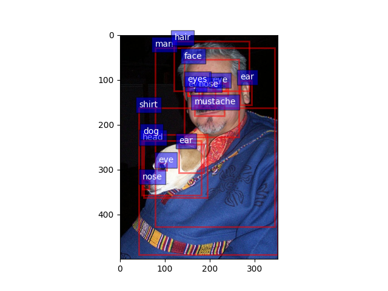

# Description
This package is used in: https://github.com/ntu-rris/autonomous_ws


This package make use of Faster-RCNN pretrained with Visual Genome dataset(implementation from <https://github.com/shilrley6/Faster-R-CNN-with-model-pretrained-on-Visual-Genome>) to perform door detection.

This package uses ROS Melodic.

# Installation
The installation requires anaconda (https://www.anaconda.com/products/distribution)

## Dependencies:
1. custom_msgs: https://github.com/ntu-rris/custom_msgs

## Install Faster-RCNN pretrained with Visual Genome dataset

1. Clone the github repo into scripts/FasterRCNN

```
cd scripts
git clone https://github.com/shilrley6/Faster-R-CNN-with-model-pretrained-on-Visual-Genome FasterRCNN
```

2. Create a virtual environment with python3.7

```
conda create -n FasterVgOpen python=3.7
```

3. Activate the environment

```
conda activate FasterVgOpen
```

4. Install dependencies

```
cd FasterRCNN
pip install -r requirements.txt
```

5. Install CUDA and GPU driver compatible with Pytorch(Here uses CUDA 11.3).
>Follow this link for more information on how to install CUDA https://medium.com/analytics-vidhya/installing-any-version-of-cuda-on-ubuntu-and-using-tensorflow-and-torch-on-gpu-b1a954500786

>Link for CUDA Toolkit Version = 11.3:
<https://developer.nvidia.com/cuda-11.3.0-download-archive?target_os=Linux&target_arch=x86_64&Distribution=Ubuntu&target_version=18.04&target_type=deb_local>

6. Check /usr/local/cuda-VERSION/bin if nvcc is installed

7. Export path and library_path(Here VERSION = 11.3):

```
export PATH=/usr/local/cuda-VERSION/bin${PATH:+:${PATH}}
```

```
export LD_LIBRARY_PATH=/usr/local/cuda-VERSION/lib${LD_LIBRARY_PATH:+:${LD_LIBRARY_PATH}}
```


8. Install Pytorch 1.10.0 (newer version would result in error when running python setup.py in /lib)

```
conda install pytorch==1.10.0 torchvision==0.11.0 torchaudio==0.10.0 cudatoolkit=11.3 -c pytorch -c conda-forge
```

9. Compile cuda dependencies:

```
cd FasterRCNN/lib
python setup.py build develop
```

10. Install imageio

```
conda install -c conda-forge imageio
```

11. Install Pycocotools(Optional)

```
cd FasterRCNN/data
git clone https://github.com/pdollar/coco.git
cd coco/PythonAPI
make
```

12. Download pretrained model from <https://drive.google.com/file/d/18n_3V1rywgeADZ3oONO0DsuuS9eMW6sN/view?usp=sharing> , create a folder named "models" and
place the downloaded model in scripts/FasterRCNN/models

13. To run demo.py, you might encounter error regarding numpy(), if so add in line 353:

```
    bbox = bbox.cpu()
```

14. Change line 374 in lib/model/utilsconfig.py from

```
    yaml_cfg = edict(yaml.load(f))
```

to

```
    yaml_cfg = edict(yaml.safe_load(f))
```

15. To test whether it is successfully installed:

```
python demo.py --net res101 --dataset vg --cuda
```

below shows the demo results:
<div align = 'center'>

</div>

## Install Faster-RCNN and SSD pretrained on OpenImages_v4

1. Download pretrained model:
    * Faster-RCNN: <https://tfhub.dev/google/faster_rcnn/openimages_v4/inception_resnet_v2/1>
    * SSD: <https://tfhub.dev/google/openimages_v4/ssd/mobilenet_v2/1>

2. Create a folder named "inception" in object_detector/scripts and extract the Faster-RCNN file downloaded(faster_rcnn_openimages_v4_inception_resnet_v2_1.tar.gz) into the "inception" folder.

3. Create a folder named "mobilenet" and extract the SSD file downloaded (openimages_v4_ssd_mobilenet_v2_1.tar.gz) into the "mobilenet" folder.

4. Install tensorflow and tensorflow-hub in the same virtual env as the one used for FasterRCNN pretrained with Visual Genome:
```
conda install -c conda-forge cudnn=8.2.0
python3 -m pip install tensorflow
python3 -m pip install tensorflow-hub
```

5. Check if the GPU version of tensorflow is properly installed:
```
conda activate FasterVgOpen
export LD_LIBRARY_PATH=$LD_LIBRARY_PATH:$CONDA_PREFIX/lib/
python3 -c "import tensorflow as tf; print(tf.config.list_physical_devices('GPU'))"
```
it should return
```
[PhysicalDevice(name='/physical_device:GPU:0', device_type='GPU')]
```
NOTE: Restart the terminal after the check, else it will affect the catkin build process.

## Setup ros with Python3

1. Install rospkg for python3 in the virtual environment used:

```
conda install -c conda-forge rospkg
```

2. Install empy in the virtual environment:

```
pip install empy
```

3. Set catkin config to python 3:

```
catkin config -DPYTHON_EXECUTABLE=/home/marcus/anaconda3/envs/FasterVgOpen/bin/python3 -DPYTHON_INCLUDE_DIR=/home/marcus/anaconda3/envs/FasterVgOpen/include/python3.7m -DPYTHON_LIBRARY=/home/marcus/anaconda3/envs/FasterVgOpen/lib/libpython3.7m.so
```

4. install cv_bridge for python3, refer to <https://cyaninfinite.com/ros-cv-bridge-with-python-3/> if more info needed:

```
git clone -b melodic https://github.com/ros-perception/vision_opencv.git
catkin build cv_bridge
```

5. Ensure that the libuuid in the virtual environment used is the same version as ROS(i.e libuuid.so.1.3.0) else back up the current version(here shows 1.1.0):
```
mv ~/anaconda3/FasterVgOpen/lib/libuuid.so ~/anaconda3/FasterVgOpen/lib/libuuid.so.back
mv ~/anaconda3/FasterVgOpen/lib/libuuid.so.1 ~/anaconda3/FasterVgOpen/lib/libuuid.so.1.back
mv ~/anaconda3/FasterVgOpen/lib/libuuid.so.1.1.0 ~/anaconda3/FasterVgOpen/lib/libuuid.so.1.1.0.back
```
and copy/link the libuuid used by ros(located at /lib/x86_64-linux-gnu/):
```
ln -s /lib/x86_64-linux-gnu/libuuid.so ~/anaconda3/envs/FasterVgOpen/lib/libuuid.so
ln -s /lib/x86_64-linux-gnu/libuuid.so.1 ~/anaconda3/envs/FasterVgOpen/lib/libuuid.so.1
ln -s /lib/x86_64-linux-gnu/libuuid.so.1.3 ~/anaconda3/envs/FasterVgOpen/lib/libuuid.so.1.3
```

6. Deactivate conda virtual environment, source the workspace and build the package:
```
conda deactivate
source devel/setup.bash
catkin build object_detector
```
Note: Ensure that the LD_LIBRARY_PATH **does not** include the path to any of the anaconda virtual environment lib directory.

7. In ```scripts/ros_demo.py```, replace the following with your own python interpreter.

```
#!/home/marcus/anaconda3/envs/FasterVgOpen/bin/python
```

# How to run
First, source your workspace by:
```
source devel/setup.bash
```

## To launch detection with model pretrained with Open Image dataset:
To run the GPU version, append the path to anaconda virtual environment lib to LD_LIBRARY_PATH. Omit this to run on CPU:
```
export LD_LIBRARY_PATH=$LD_LIBRARY_PATH:$CONDA_PREFIX/envs/FasterVgOpen/lib/
```
then run
```
roslaunch object_detector faster_open.launch
```

## To launch detection with model pretrained on Visual Genome dataset:
This by default will run in GPU version. It will run on CPU if no GPU is found.
```
roslaunch object_detector faster_vg.launch
```

## Activate the detection:
1. The detection is activated through the action, */detection_as*. One simple way of sending goal to the action server is through axclient:
```
rosrun actionlib axclient.py /detection_as custom_msgs/doorway_detectionAction
```

2. A small window will pop up, leave the doorway_request as '' and simply click the **SEND GOAL** button to activate the detection. Click on the **CANCEL GOAL** to stop the detection.

3. The detection output will be shown by the ros topic:
    1. */faster_rcnn_output/compressed* for faster_open.launch
    2. */faster_rcnn_output/raw* for faster_vg.launch

# Examples:
1. Download the bag file from https://entuedu.sharepoint.com/:u:/r/teams/WP1SharedControlWheelchair/Shared%20Documents/Resources/Bagfiles/detection_lab_2022-07-08-11-11-31.bag?csf=1&web=1&e=MYmwgf

2. Run roscore:
```
roscore
```

3. Open a new terminal and play the bag file:
```
rosbag play -l detection_lab_2022-07-08-11-11-31.bag
```

4. Launch the detection as mentioned in the *How to run* section.

5. run rviz and add the topic as mentioned in *How to run* section to observe the output.
>Note that the detection might only work certain periods of the bag file due to timing issue()only works after 25 sec